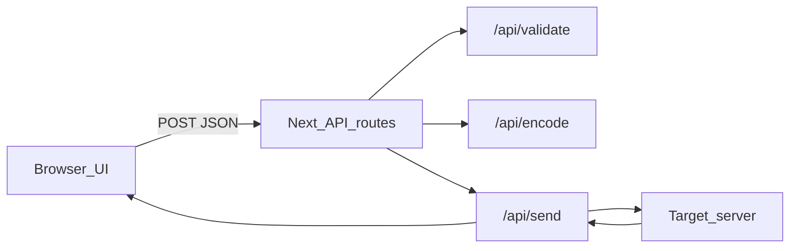

# HTTP Learning Checker

Educational web app to learn how HTTP requests work end to end: compose headers line by line, validate them by HTTP version, send through a controlled Node proxy, and inspect text wire format or HTTP/2–3 binary frames (including HPACK/QPACK explainers and RFC/MDN doc links).

## Run

```bash
npm install
npm run dev
```

Open [http://localhost:3000](http://localhost:3000).

Production build:

```bash
npm run build
npm start
```

> Live HTTP/3 uses `@currentspace/http3` (bundled). Encode/QPACK views work even if a given target rejects QUIC.

## Purpose

| Goal | How the app helps |
|------|-------------------|
| Learn request shape | Edit method, URL, headers, and body manually |
| Learn version rules | Validate required / forbidden headers for HTTP/1.0, 1.1, 2, 3 |
| Catch duplicate headers | Warnings with version-specific explanation (H2/H3 Send keeps last value) |
| Learn the wire | Encode text (1.x) or educational binary frames (2 / 3) |
| Learn the flow | Lifecycle log: compose → validate → encode → connect → write → read |
| Verify against specs | Links to RFCs and MDN on issues, methods, status codes, glossary |
| Build & reuse requests | Collections, environments (`{{var}}`), share URL, OpenAPI import |
| Test without the network | Mock rules; post-response assertions |

This is an **educational client**, not a production API tester.

## Architecture

The UI runs in the browser. Validate/Encode/Send call **Next.js API routes** on the same app. Only **Send** opens a real network connection to the URL you entered (the API process acts as a teaching proxy).

```text
Browser UI  --POST JSON-->  Next.js API routes
                               |-- /api/validate   (no outbound network)
                               |-- /api/encode     (no outbound network)
                               |-- /api/send       --> target server (httpbin, etc.)
                               |-- /api/http3-support
                               |-- /api/ws         (WebSocket relay)
                               |-- /api/mqtt       (MQTT publish bridge)
```



### Why a backend is required

Browsers cannot freely:

- Force HTTP/1.0, 1.1, 2, or 3
- Show accurate wire bytes through TLS
- Bypass CORS for arbitrary targets
- Omit `Host` the way this lab does (`setHost: false` in Node)

So the Node process is a **controlled teaching proxy**: it validates, encodes, sends, and returns a learning log (including what was actually sent).

### What the backend is not

- Not hosting your target API
- Not a public open proxy (timeouts, size limits, private-IP blocking by default)
- Not a store for history (history lives in browser `localStorage`)

## How the URL is used

The **URL** field is the absolute target. It is split and used differently from header lines:

| Piece | Example | Used for |
|-------|---------|----------|
| Protocol | `https:` | TLS vs plain; HTTP/2–3 require HTTPS |
| Host / port | `httpbin.org` / `443` | Where to connect; SSRF checks |
| Path + query | `/get?x=1` | Request-line path or `:path` |

Important teaching point:

- **Connect to** host + port from the URL  
- **Request line / `:path`** carries only path + query (`GET /get HTTP/1.1`)  
- **`Host` / `:authority`** is separate metadata (you type `Host:` for learning on 1.x; on H2/H3 the app sets `:authority` from the URL)

## Request line vs pseudo-headers (HTTP/1.x → 2 → 3)

This is the core teaching note shown in the UI when version **2** or **3** is selected.

### HTTP/1.0 and HTTP/1.1 — text request line

The message starts with a readable first line, then headers, blank line, optional body:

```http
GET /get?x=1 HTTP/1.1
Host: example.com
Accept: application/json

```

| Piece | Where it lives |
|-------|----------------|
| Method | Request line (`GET`) |
| Path + query | Request line (`/get?x=1`) |
| Version token | Request line (`HTTP/1.1`) |
| Host | Regular header `Host:` |

### HTTP/2 and HTTP/3 — no text request line

There is **no** `GET /path HTTP/2` (or `HTTP/3`) text line on the wire. Method, scheme, path, and authority become **pseudo-headers** (field names that start with `:`), placed first in the compressed header block:

| Pseudo-header | Meaning | Filled from in this app |
|---------------|---------|-------------------------|
| `:method` | HTTP method | Method dropdown |
| `:scheme` | `http` or `https` | URL protocol |
| `:path` | Path + query only | URL pathname + search |
| `:authority` | Host[:port] | URL authority (replaces the role of `Host`) |

Lines you type in the header editor (`Accept:`, `User-Agent:`, …) become the **regular header fields** after those pseudo-headers.

**Do not rely on** connection-specific or hop-by-hop headers the way you would on HTTP/1.x:

- `Connection`, `Transfer-Encoding`, `Upgrade`, `Keep-Alive` are **forbidden** on HTTP/2 and HTTP/3 (validation errors in this app).
- Classic `Host` is not how H2/H3 name the target on the wire; this app maps authority via `:authority` from the URL (see Encode → Pseudo-headers).

### How this app maps your UI into each version

```text
UI: Method + URL + header lines + body
        │
        ├─ HTTP/1.x  →  request-line text + Host (you type or app injects) + headers + body
        ├─ HTTP/2    →  :method :scheme :path :authority + regular headers
        │                 packed in HEADERS frames, compressed with HPACK (TLS/TCP)
        └─ HTTP/3    →  same logical pseudo-headers + regular headers
                          in HTTP/3 HEADERS frames, compressed with QPACK (QUIC/UDP)
```

### HTTP/2 vs HTTP/3 packing (same ideas, different transport)

| | HTTP/2 | HTTP/3 |
|---|--------|--------|
| Transport | TLS over **TCP** | **QUIC** over **UDP** (TLS 1.3 inside QUIC handshake) |
| Header compression | **HPACK** | **QPACK** |
| Message shape | Binary **HEADERS** (+ **DATA**) frames | HTTP/3 **HEADERS** (+ **DATA**) frames |
| Host on the wire | `:authority` (not a text `Host` line) | `:authority` (same idea) |
| In this app | Encode / Compare 1.1 vs 2 | Encode / Compare 2 vs 3; live Send via QUIC client |

Use **Encode** or **Compare** to see hex/frames. Use **Send** on an h3-capable host to see **Actually sent** (pseudo-headers, Alt-Svc, transport).

### Spec references

- [RFC 9112](https://www.rfc-editor.org/rfc/rfc9112) — HTTP/1.1 messaging (request line, Host)  
- [RFC 9113 §8.3](https://www.rfc-editor.org/rfc/rfc9113#name-request-pseudo-header-fields) — HTTP/2 request pseudo-headers  
- [RFC 9114](https://www.rfc-editor.org/rfc/rfc9114#name-http-control-data) — HTTP/3 HTTP control data  
- [RFC 7541](https://www.rfc-editor.org/rfc/rfc7541) — HPACK  
- [RFC 9204](https://www.rfc-editor.org/rfc/rfc9204) — QPACK  
- [RFC 9000](https://www.rfc-editor.org/rfc/rfc9000) — QUIC  

## Duplicate headers (client vs server)

Typing the same header name twice in the editor (e.g. two `Accept:` lines) raises a common question: **is that allowed, and who decides?**

### Does it depend on the client?

**Yes.** Whether duplicates appear on the wire is largely a **client / library** choice:

| Actor | Typical behavior |
|-------|------------------|
| Browser, curl, this app, Node `http2`, H3 SDKs | May send both values, merge with `, `, or keep **first** / **last** only |
| HTTP/2 and HTTP/3 specs | **Pseudo-headers** (`:method`, `:path`, …) **must not** be duplicated (malformed request). Regular fields should not be treated like free-form HTTP/1.x duplicate lines |
| This app (H2 / H3 **Send**) | Builds a name → value map → **last line wins**; earlier duplicates are **not** sent |
| This app (HTTP/1.x **Send**) | Can still emit **separate header lines** for the same name |
| This app (**Encode**) | May still list both lines in the educational HPACK/QPACK view even when Send would collapse them |

So two clients can behave differently for the same editor input. Always check **Actually sent** after Send.

### If the server receives duplicates, what happens?

**Once bytes arrive, the server (and intermediaries) apply protocol rules plus their own policy.**

**HTTP/1.1**

- Duplicate header *lines* are common and often legal for list-valued fields.
- [RFC 9110](https://www.rfc-editor.org/rfc/rfc9110): if a field allows a list, receivers **may combine** same-name fields into one comma-separated value.
- Some fields are special (e.g. more than one `Host` is often an error / **400**).
- Real servers still vary: **combine**, take **first**, take **last**, or **reject**.

**HTTP/2 / HTTP/3**

- Headers arrive as one **compressed header block** (HPACK / QPACK), not as independent text lines like HTTP/1.x.
- Duplicate **pseudo-headers** → malformed; compliant peers should error (stream/connection error).
- Duplicate **regular** names: discouraged; stacks may **normalize** (merge or overwrite) before app code runs, **reject** the request, or expose one string / an array depending on the framework.

### Mental model

```text
You type two Accept lines
        │
        ▼
Client library ──► may send 0, 1, or 2 logical values
        │
        ▼
On the wire (H2/H3): one HEADERS block (HPACK/QPACK)
        │
        ▼
Server HTTP stack ──► validate / merge / reject
        │
        ▼
Application code ──► usually one value (or an array if the framework keeps multiples)
```

### Practical guidance

- For **HTTP/2 and HTTP/3**, prefer **one line per header name**, or one combined value (`Accept: application/json, text/html`).
- Do **not** rely on duplicate header lines for H2/H3 interoperability.
- This app’s H2/H3 “last wins” Send behavior is a **realistic client** pattern, not a Cloudflare-only quirk.
- **Validate** emits a **warning** when the same header name appears more than once (case-insensitive), with a short panel explanation and RFC/MDN links. On H2/H3 the message states that Send keeps the **last** value.

### Validation in this app

Click **Validate** (or **Send**, which validates first) to run rules in `lib/validate/rules.ts`. Issues are **error**, **warning**, or **info**, with RFC/MDN links when available.

| Rule | Severity | Versions |
|------|----------|----------|
| Missing URL / invalid URL | error | all |
| Bad header line or name | error | all |
| **Duplicate header name** | **warning** | all (message differs for 1.x vs 2/3) |
| Missing `Host` | error | 1.1 |
| `Host` mismatch with URL | warning | 1.1 |
| Both `Content-Length` and `Transfer-Encoding` | error | all |
| Connection-specific headers | error | 2, 3 |
| GET with body | warning | all |
| Duplicate `Accept` labs | — | use presets below |

**Duplicate header warnings**

- **HTTP/1.x** (`duplicate_header_http1`): both lines may be sent; servers may combine, take first/last, or reject.
- **HTTP/2 / 3** (`duplicate_header_h2h3`): Send keeps the **last** value only; message includes line numbers and that value.
- Validation panel shows a yellow **Duplicate headers detected** callout when any duplicate is found.

## API routes

| Route | Method | Network to target? | Role |
|-------|--------|--------------------|------|
| `/api/validate` | POST | No | Version-specific header/method rules |
| `/api/encode` | POST | No | Educational wire/frames; optional compare pairs |
| `/api/send` | POST | **Yes** | Validate → encode → send → return log + response + `sent` |
| `/api/http3-support` | GET | No | Whether `@currentspace/http3` and/or curl HTTP3 are available |

### Send payload (conceptually)

```json
{
  "version": "1.1",
  "method": "GET",
  "url": "https://httpbin.org/get",
  "headerText": "Host: httpbin.org\nAccept: application/json",
  "body": "",
  "sendAnyway": false,
  "allowPrivateTargets": false
}
```

### Send response highlights

- `validation` — issues with optional RFC/MDN `docs` links  
- `encode` — educational wire / frames / HPACK or QPACK (and `quicTimeline` for version 3)  
- `sent` — **actually sent** curl, headers, HTTP/1.x wire text + hex; for H2/H3 also protocol, transport, Alt-Svc, stream id, pseudo-headers  
- `response` — status, headers, body, negotiated protocol  
- `steps` — lifecycle timeline for the UI (includes QUIC educational steps on H3)  

## Protocol support

| Version | Live send | Wire / Binary view |
|---------|-----------|--------------------|
| HTTP/1.0, 1.1 | Node `http` / `https` | Exact text message + hex |
| HTTP/2 | Node `http2` (HTTPS + ALPN `h2`) | Educational frames + HPACK; `:authority` instead of `Host` |
| HTTP/3 | **`@currentspace/http3`** first, then `curl --http3` fallback | Educational frames + QPACK + QUIC/TLS timeline |

### HTTP/3 implementation (this app)

HTTP/3 support is both **educational** (always) and **live** (when the transport and target allow it).

#### 1. Compose and validate

- Version selector `3` shows the pseudo-header teaching callout (same logical model as HTTP/2).  
- Validation rejects connection-specific headers (`Connection`, `Transfer-Encoding`, …).  
- Regular headers you type are sent as lowercase field names on the H3 header block; `:authority` is taken from the URL.

#### 2. Educational encode (no network required)

- Builds conceptual QUIC handshake notes + HTTP/3 HEADERS/DATA frame hex.  
- Shows QPACK-style field encoding for the current headers.  
- Attaches a **QUIC / TLS 1.3 timeline** (UDP → handshake → SETTINGS → request stream).  
- This is **not** a raw UDP packet capture; TLS still encrypts real bytes on the network.

#### 3. Live send pipeline

```text
Send (version 3)
  → SSRF / https check
  → Alt-Svc probe (HTTPS HEAD over TCP) — records Alt-Svc if present
  → Prefer @currentspace/http3 (QUIC + TLS 1.3)
       else curl --http3 if system curl has HTTP3
  → Return response + sent{ protocol, transport, altSvc, streamId, pseudoHeaders, curl, … }
  → UI: Lifecycle + Wire/Binary (Actually sent + QUIC timeline + QPACK frames)
```

| Step | Module | Behavior |
|------|--------|----------|
| Alt-Svc probe | `lib/clients/alt-svc.ts` | HEAD over Node `https`; parse `Alt-Svc` (e.g. `h3=":443"; ma=86400`) |
| Primary H3 client | `lib/clients/http3.ts` + `@currentspace/http3` | `connectAsync` → `session.request` with pseudo-headers |
| Fallback | same file + system `curl` | `curl --http3 -i …` when currentspace fails or is unavailable |
| Support probe | `GET /api/http3-support` | `{ curlHttp3, currentspace }` for the UI banner |
| Timeline copy | `lib/learn/quic-timeline.ts` | Educational steps merged into encode / lifecycle |
| Frames / QPACK | `lib/encode/http3-frames.ts` | Always available via Encode / Compare |

#### 4. Actually sent (H3)

After a successful live Send, Wire / Binary shows:

- Negotiated **protocol** (`HTTP/3`)  
- **Transport** (`currentspace` or `curl`)  
- **Alt-Svc** observed on probe and/or response  
- **Stream id** when available  
- **Pseudo-headers** actually used (`:method`, `:scheme`, `:authority`, `:path`)  
- QUIC notes + equivalent **curl --http3** command  

#### 5. Labs and compare

- **HTTP/3 GET (Cloudflare)** / **Lab: H3-only style target** — try live Send  
- **Lab: H3 :authority from URL** — no `Host` line; Encode still sets `:authority`  
- **Lab: Connection header on H3** — expect validation error  
- **Lab: Duplicate Accept (1.1 / H2 / H3)** — duplicate-header validation warning  
- **Lesson: HPACK vs QPACK** + **Compare 2 vs 3** — side-by-side compression teaching  

Encode/QPACK views work even when live QUIC to a given host fails.

### Host and “Send anyway” (HTTP/1.1)

- Validation fails HTTP/1.1 requests missing `Host` (RFC 9112).  
- With **Send anyway**, the proxy uses Node `setHost: false` so `Host` is **not** auto-added (unlike a naive Node client).  
- The **Wire / Binary → Actually sent** panel shows whether Host was present and the equivalent curl.  
- Some servers still return 200 without Host; a 400 is not guaranteed.

### Compare modes (encode only, no network)

- Compare 1.1 vs 2 — text wire vs H2 + HPACK  
- Compare 1.1 vs 3 — text wire vs H3 + QPACK  
- Compare 2 vs 3 — HPACK vs QPACK lesson  

## Project structure

```text
http_checker/
  app/
    page.tsx                 # Main composer + learning UI
    layout.tsx
    globals.css
    api/
      validate/route.ts
      encode/route.ts
      send/route.ts
      http3-support/route.ts
  components/
    RequestEditor.tsx        # Includes H2/H3 pseudo-header teaching callout
    ValidationPanel.tsx      # Issues + duplicate-header callout
    LearningLog.tsx
    BinaryFrameView.tsx      # Wire/frames + “Actually sent”
    LifecycleTimeline.tsx
    QuicTimelinePanel.tsx
    CompressionLesson.tsx    # HPACK vs QPACK
    DocsPanel.tsx
    DocLinks.tsx
    ExportBar.tsx
  lib/
    types.ts
    parse.ts                 # URL + header line parsing
    safety.ts                # SSRF, timeouts, size limits
    validate/rules.ts
    encode/
      http1.ts
      http2-frames.ts
      http3-frames.ts
      bytes.ts
      index.ts
    clients/
      http1.ts
      http2.ts
      http3.ts               # currentspace + curl + Alt-Svc
      alt-svc.ts
      sent.ts                # Actual wire + curl reconstruction
      index.ts               # executeRequest orchestration
    learn/
      presets.ts
      glossary.ts
      docs.ts
      export.ts
      history.ts
      collections.ts
      environments.ts
      assertions.ts
      mock.ts
      openapi.ts
      share.ts
      cookies.ts
      quic-timeline.ts
    env/
      substitute.ts
    import/
      raw-http.ts
      curl.ts
      auth.ts
    request/
      prepare.ts
  ROADMAP.md
```

## Request editor tabs

| Tab | Purpose |
|-----|---------|
| **Request** | Version, protocol, method, URL, headers, body type, options |
| **Params** | Query parameters (toggle without losing in-progress keys) |
| **Auth** | Basic, Bearer, API key → headers or query |
| **Import** | Raw HTTP, curl, OpenAPI 3 JSON |

## Features (UI)

### HTTP learning (core)
- Line-by-line header editor + body (text, JSON, GraphQL, multipart)  
- HTTP version selector (1.0 / 1.1 / 2 / 3)  
- **Protocol** selector: HTTP, GraphQL, WebSocket, SSE, gRPC (gateway), MQTT (bridge)  
- Expanded **pseudo-header vs request-line** explanation for HTTP/2 and HTTP/3  
- Validate, Encode, Compare (1.1/2/3 pairs), Send  
- **Duplicate header warnings** with version-specific messages and panel callout  
- Lifecycle, Wire/Binary (including **Actually sent** + QUIC timeline), Response tabs  
- Response teaching: status codes, 3xx + Location, Set-Cookie panel, timing breakdown  
- Redirect chain when **Follow redirects** is enabled (HTTP/1.x)  
- Pseudo-headers, HPACK/QPACK field notes, frame annotations  
- HPACK vs QPACK lesson + **Multiplex lesson** (H1 vs H2 vs H3)  
- Presets / labs (Missing Host, duplicate Accept, redirects, Set-Cookie, H2/H3 Connection, …)  
- Glossary + version docs panel (RFC/MDN)  
- History in `localStorage` with **Clear history**  

### Import & export
- **Import:** raw HTTP/1.x, curl, OpenAPI 3 JSON → collections  
- **Export:** curl, fetch, raw HTTP/1.x, Python `requests`, axios, Go  
- **Share URL** — encode request in `#share=…` (no account)  

### API-client style (local-only)
- **Collections / folders** — save and reload requests  
- **Environments** — `{{variable}}` substitution before Validate/Send  
- **Assertions** — post-response checks (status, header contains, body contains)  
- **Mock server** — match rules on Send without network  
- **CI export** — Postman collection JSON + bash curl script from collections  

## Browser storage (`localStorage`)

| Key | Contents |
|-----|----------|
| `http-learning-checker-history` | Last 30 Send summaries |
| `http-learning-checker-collections` | Saved requests |
| `http-learning-checker-folders` | Collection folder names |
| `http-learning-checker-environments` | Environment variable sets |
| `http-learning-checker-active-env` | Selected environment id |
| `http-learning-checker-mocks` | Mock response rules |

## History storage

- **Where:** browser `localStorage`  
- **Key:** `http-learning-checker-history`  
- **Max:** 30 entries  
- **When:** after Send  
- **Clear:** UI **Clear history** button, or  
  `localStorage.removeItem("http-learning-checker-history")`  

## Safety defaults

- Block private / link-local / localhost targets unless **Allow private targets** is checked  
- Request timeout (~15s)  
- Response body capped (~512 KiB)  
- No server-side credential persistence  

## Suggested learning path

1. Load **httpbin GET** → Validate → Encode → Send → inspect Response + Actually sent.  
2. Load **Lab: Missing Host (1.1)** → Validate (fail) → enable Send anyway → Send → confirm Host omitted on Wire tab.  
3. Switch to HTTP/2 → read the pseudo-header callout → Encode → see HPACK frames.  
4. Load **Lab: Duplicate Accept (H2)** → Validate → note warning and “last wins” on Send → check **Actually sent**.  
5. Load **HTTP/3 GET (Cloudflare)** → Send → inspect Alt-Svc, transport, QUIC timeline, Actually sent pseudo-headers.  
6. Load **Lesson: HPACK vs QPACK** → **Compare 2 vs 3**.  
7. **Import** tab → paste curl or raw HTTP → Apply.  
8. **Environments** → `{{baseUrl}}/get` → Send.  
9. **Lab: Redirect (302)** → with/without Follow redirects.  
10. **Mock** panel → rule + Use mock → Send (no network).  
11. See [ROADMAP.md](./ROADMAP.md) Phase 1 & 2 review checklists.

## Stack

- Next.js (App Router) + TypeScript + React  
- Tailwind CSS  
- Node built-ins: `http`, `https`, `http2`  
- `@currentspace/http3` for live HTTP/3 (QUIC)  
- `ws` — WebSocket relay  
- `mqtt` — MQTT publish bridge (educational)  
- Optional fallback: system `curl` with HTTP3 support  

## Roadmap

See [ROADMAP.md](./ROADMAP.md) for planned features and review checklists. **Phase 1** and **Phase 2** are complete; Phase 3–4 track intercept tools and deeper protocol labs.

## License

Private / local learning project unless you add a license file.
